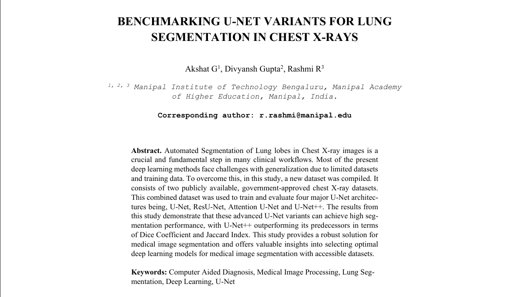

# Benchmarking U-Net Variants for Lung Segmentation in Chest X-Rays

## Overview
This repository contains the code and evaluation framework for benchmarking advanced deep learning architectures on the task of automated lung lobe segmentation. Precise lung segmentation is a critical precursor for Computer-Aided Diagnosis (CAD) in monitoring pulmonary diseases such as tuberculosis and pneumonia. This project evaluates four prominent U-Net variants on a diverse, combined dataset of healthy and pathological chest X-rays to establish optimal architectures for clinical workflows.

## Research & Documentation

> **Abstract:** Automated Segmentation of Lung lobes in Chest X-ray images is a crucial and fundamental step in many clinical workflows. Most of the present deep learning methods face challenges with generalization due to limited datasets and training data. To overcome this, in this study, a new dataset was compiled. It consists of two publicly available, government-approved chest X-ray datasets. This combined dataset was used to train and evaluate four major U-Net architectures being, U-Net, ResU-Net, Attention U-Net and U-Net++. The results from this study demonstrate that these advanced U-Net variants can achieve high segmentation performance, with U-Net++ outperforming its predecessors in terms of Dice Coefficient and Jaccard Index. This study provides a robust solution for medical image segmentation and offers valuable insights into selecting optimal deep learning models for medical image segmentation with accessible datasets.

## Methodology & Architecture

### Datasets & Preprocessing
To ensure robust generalization, models were trained on a combined dataset comprising 704 images from:
* **Montgomery County (MC) Dataset:** Contains healthy and tuberculosis-affected X-rays.
* **Shenzhen Dataset:** Contains healthy and tuberculosis-affected X-rays.

All images underwent a strict preprocessing pipeline:
* Bilinear interpolation resizing to 256x256 pixels.
* Min-max normalization.
* Conversion to Keras-compatible NumPy arrays.

### Evaluated Architectures
The study benchmarked four distinct architectures to analyze the impact of residual connections, attention mechanisms, and dense skip pathways:
1.  **Baseline U-Net:** Standard encoder-decoder architecture.
2.  **ResU-Net:** Incorporates residual blocks to mitigate vanishing gradients in deeper networks.
3.  **Attention U-Net:** Utilizes attention gates to selectively focus on relevant features and suppress background noise.
4.  **U-Net++:** Employs an inverse-pyramidal structure with dense, nested skip connections to minimize the semantic gap between the encoder and decoder.

## Evaluation & Metrics

The models were evaluated using spatial overlap metrics and boundary distance metrics to assess both pixel-level accuracy and boundary alignment. 

$$Dice Coefficient = \frac{2 \times TP}{2 \times TP + FP + FN}$$

$$J(P, G) = \frac{|P \cap G|}{|P \cup G|}$$

### Quantitative Results (Test Set)
U-Net++ emerged as the most effective architecture, demonstrating superior multi-scale feature refinement.

| Model | Dice Coefficient | Jaccard Index (IoU) | F1-Score | HD (pixels) | ASSD (pixels) |
| :--- | :---: | :---: | :---: | :---: | :---: |
| **U-Net** | 0.9560 | 0.9151 | 0.9555 | 13.5736 | 1.7840 |
| **ResU-Net** | 0.9627 | 0.9291 | 0.9631 | 12.4979 | 1.4583 |
| **Attention U-Net** | 0.9558 | 0.9149 | 0.9561 | 13.4723 | 1.7355 |
| **U-Net++** | **0.9661** | **0.9343** | **0.9708** | **11.6183** | **1.3419** |
